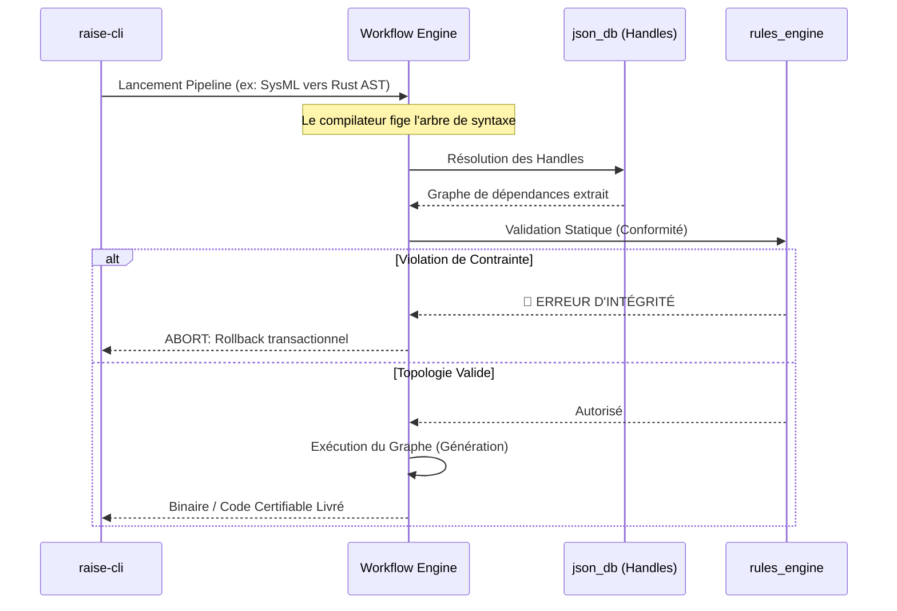

# ⚙️ Workflow Engine (Orchestrateur Asynchrone)

Ce module implémente le cœur d'exécution du framework R.A.I.S.E.
Conçu pour les environnements industriels critiques, il s'agit d'un **Orchestrateur de Graphes Orientés Acycliques (DAG)** strictement déterministe. Il garantit que chaque étape d'un pipeline d'ingénierie (transformation de modèles, génération de code, audit) est exécutée selon des règles mathématiques invariables.

---

## 🏛️ Architecture : Découplage et Tolérance Zéro

Le système repose sur la séparation stricte entre la définition du pipeline (le Schéma) et son exécution (le Runtime).

| Composant         | Fichier            | Rôle & Responsabilité                                                                                                    |
| ----------------- | ------------------ | ------------------------------------------------------------------------------------------------------------------------ |
| **Pipeline** | `pipeline.rs`      | **La Spécification**. Structure JSON-LD définissant les étapes de transformation MBSE ou les builds DevSecOps.           |
| **Compiler** | `compiler.rs`      | **Le Validateur**. Transforme le pipeline en un Graphe (DAG) après avoir vérifié l'intégrité de tous les *handles*.      |
| **Scheduler** | `scheduler.rs`     | **Le Chef d'Orchestre**. Gère le cycle de vie des instances et la distribution asynchrone des tâches (via Tokio).        |
| **Executor** | `executor.rs`      | **Le Moteur d'Exécution**. Exécute les tâches atomiques dans un contexte strictement déterministe.                       |
| **State Machine** | `state_machine.rs` | **Le Navigateur**. Assure la transition d'états (ACID) pour garantir la reprise sur erreur en environnement Air-Gap.     |

---

## ♊ L'Ancrage de Données (Data Grounding)

Dans l'ingénierie dirigée par les modèles (MBSE 2.0), la cohérence entre les différents niveaux d'architecture (Opérationnel, Système, Logique, Physique - méthode Arcadia) est vitale. Le `workflow_engine` s'assure qu'aucune transformation ne viole les règles de l'art.

### Flux de Transformation Déterministe



---

## 📜 Le Dogme de Production

Le `WorkflowEngine` est le garant du **Dogme de Pureté** du framework R.A.I.S.E. :

* **Zéro Code de Test :** L'orchestrateur vérifie à la compilation qu'aucune condition de test n'est présente dans les branches d'exécution critiques.
* **Contexte Dynamique :** Si le pipeline est invoqué sans arguments explicites de domaine, l'orchestrateur applique un *smart fallback* sur la session courante, évitant les erreurs de configuration en mode déconnecté.

---

## 🧩 Modèle de Tâches (Nœuds du Graphe)

| Type | Description | Comportement |
| --- | --- | --- |
| **`Transform`** | Mutation AST | Applique une transformation structurelle sur le modèle de données (SysML v2). |
| **`ToolCall`** | Action Système | Invoque un **Outil Natif** (Lecture disque, appel binaire local). Déterministe. |
| **`GatePolicy`** | Point de Contrôle | Vérifie une règle stricte (ex: couverture de code). **Bloquant**. |
| **`Parallel`** | Fork Execution | Lance plusieurs branches simultanément via le runtime multi-thread (Rayon). |

```

